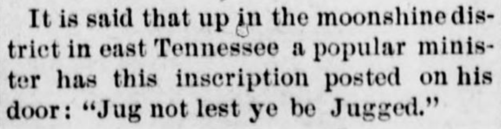

```{r setup, include=FALSE}
knitr::opts_chunk$set(echo = FALSE, message = FALSE, warning = FALSE,
                      comment = NA)
```

## Primary sources

All of the newspapers used in this project come from the Library of Congress, *[Chronicling America: Historic American Newspapers](http://chroniclingamerica.loc.gov/)*. The data for this project was accessed through the *Chronicling America* [API](http://chroniclingamerica.loc.gov/about/api/). The newspaper metadata comes from [the newspaper metadata API](http://chroniclingamerica.loc.gov/newspapers.json). The OCR plain text of the newspaper pages was downloaded via the [OCR Bulk Data API](http://chroniclingamerica.loc.gov/about/api/#bulk-data). As of June 2016, *America's Public Bible* uses every newspaper page available through that API, which is about 10.7 million pages. As additional OCR batches become available through the bulk data API, those pages will be added to this website.

## How the quotations were identified

This project uses techniques from a field called [machine learning](https://en.wikipedia.org/wiki/Machine_learning) to identify the quotations or verbal allusions in the newspaper pages. Below is a brief, mostly non-technical explanation of how this works.

### Extracting features

To begin, each verse in the Bible is turned into tokens, or [n-grams](https://en.wikipedia.org/wiki/N-gram). Take, for instance, the first verse of the Bible: "In the beginning, God created the heaven and the earth" (Genesis 1:1 KJV). This verse would be turned into tokens ranging from three to five words long, skipping stop words which convey little meaning (such as *an*, *of*, *the*). So the text of Genesis 1:1 becomes these tokens.

- `"god created heaven"`
- `"beginning god created heaven earth"`
- `"beginning god created"`
- `"created heaven earth"`
- `"beginning god created heaven"`
- `"god created heaven earth"`

These tokens then are used to create a document-term matrix, where the rows are the Bible verses, the columns are the tokens, and the cells indicate how many times that token appears in that verse. For instance, a subset of the Bible matrix looks like this.

```{r}
options(width = 100)
library(Matrix)
library(methods)
bible_m <- new("dgCMatrix"
    , i = c(0L, 0L, 1L)
    , p = 0:3
    , Dim = c(3L, 3L)
    , Dimnames = list(c("Genesis 1:1 (KJV)", "Genesis 1:2 (KJV)", "Genesis 1:3 (KJV)"
), c("beginning god created", "god created heaven", "without form void"
))
    , x = c(1, 1, 1)
    , factors = list()
)
bible_m <- as.matrix(bible_m)
bible_m
```

Then each newspaper page is turned into tokens using the exact same function that was used for tokenizing the Bible. This creates a second matrix where the rows are newspaper pages, the columns are three to five word tokens from the Bible, and the cells indicate how many times that string of words from the Bible is found on the newspaper page. Although the newspapers include vastly more possible tokens than are found in just the Bible, this method restricts the number of columns in the newspaper document-term matrix to the same as in the Bible matrix.

```{r}
newspaper_m <- matrix(c(1, 0, 0, 1, 0, 0, 0, 1, 0), nrow = 3)
rownames(newspaper_m) <- c("page_A", "page_B", "page_C")
colnames(newspaper_m) <- colnames(bible_m)
newspaper_m
```

Because the two matrices share a dimension, the Bible matrix can be multipled by the transpose of the newspaper matrix. The result is a matrix with Bible verses in the rows and newspaper pages in the columns. The numbers in the cells of the matrix indicate how many tokens from that verse were found on that newspaper page. So in the sample matrix below, `page_A` shares two tokens with Genesis 1:1 and `page_B` shares one token with Genesis 1:2, indicating that those verses might appear on those pages. Of course the vast majority of cells in the resulting matrix are zeros.

```{r}
tcrossprod(bible_m, newspaper_m)
```

The multiplication of document-term matrices is the primary means I have used to find matches, but the token count is only one of the features about potential matches that I measure. These are the features (or predictors) that I currently use.

- Token count: the number of tokens from a particular verse that appear on a particular newspaper page.
- TF-IDF: Not every token contains the same amount of information about whether a newspaper page contains a particular biblical verse. For instance, the phrase "went into the city" could be a quotation from a dozen or more Bible verses, but it might just as well be any English sentence. But the phrase "through a glass, darkly" is obviously a reference to [1 Corinthians 13:12](https://www.biblegateway.com/passage/?search=1+Corinthians+13%3A12&version=KJV), as these [search results](http://chroniclingamerica.loc.gov/search/pages/results/?dateFilterType=yearRange&date1=1836&date2=1922&language=&ortext=&andtext=&phrasetext=through+a+glass+darkly&proxtext=&proxdistance=5&rows=20&searchType=advanced) demonstrate. By weighting the matching tokens according to their [term frequency-inverse document frequency](https://en.wikipedia.org/wiki/Tf%E2%80%93idf), more significant terms count for more in determining a match.
- Proportion: Bible verses can vary in length, from just two words ("Jesus wept" [John 11:35] and "Rejoice evermore" [1 Thessalonians 5:16]) to the longest, Esther 8:9, which has ninety words in the King James Version. (In fact, Esther 8:9 appears in several *Chronicling America* newspapers as the [punchline of a joke](http://chroniclingamerica.loc.gov/lccn/sn97071038/1912-07-11/ed-1/seq-3/#words=king's+scribes+called+third+month+month+sivan+three+twentieth+day+thereof+written+according+mordecai+commanded+unto+jews+lieutenants+deputies+rulers+provinces+india+unto+ethiopia+hundred+twenty+seven+provinces+unto+every+province+according+writing+thereof+unto+every+people+after+language+jews+according+writing+according+language) about a "boy who boasted of his wonderful memory."^[*The Gazette-Times* (Heppner, Or.), [11 July 1912](http://chroniclingamerica.loc.gov/lccn/sn97071038/1912-07-11/ed-1/seq-3/). I have found nine instances of the verse used in a similar joke. For instance, *Daily Tobacco Leaf-Chronicle* (Clarksville, Tenn.), [12 June 1890](http://chroniclingamerica.loc.gov/lccn/sn88061072/1890-06-12/ed-1/seq-3/#words=king's+scribes+called+third+month+month+sivan+three+twentieth+day+thereof+written+according+mordecai+commanded+unto+jews+lieutenants+deputies+rulers+provinces+india+unto+ethiopia+hundred+twenty+seven+provinces+unto+every+province+according+writing+thereof+unto+every+people+after+language+jews+according+writing+according+language).]) This feature measures what proportion of the entire verse is found on the page.
- Runs test: Where the matching tokens appear on the page is as important as how many matches there are. If the tokens appear widely scattered across the page, then they are likely to be just random matches to unimportant phrases. If the tokens are all clustered right next to each other (perhaps with a few gaps for incorrect OCR), then they are likely to be a quotation from the verse. This feature uses a [statistical test](https://en.wikipedia.org/wiki/Wald%E2%80%93Wolfowitz_runs_test) to determine whether the sequence of matches (called a "run") is random or not. 

### Labeling data and training the model

After measuring the potential matches, we need a means of distinguishing between accurate matches and false positives. This is a difficult problem because of the way that the Bible was quoted in newspapers (or indeed, used more generally). If we were looking for complete quotations, then we would look for candidates where there were many matching tokens, or where a high proportion of the matching verse is present on the page. But often quotations can be highly compressed. A single unusual phrase ("Quench not the Spirit" or "Remember Lot's wife" or "The Lord called Samuel") may be enough to identify one quotation, where even a half dozen commonplace matching phrases might not actually be a quotation. Then too, sometimes allusions function by changing the actual words while retaining the syntax or cadence, as in [this joke](http://chroniclingamerica.loc.gov/lccn/sn87065532/1899-11-10/ed-1/seq-1/#date1=1836&index=2&rows=20&words=Jug+Jugged+lest+ye&searchType=basic&sequence=0&state=&date2=1922&proxtext=%22jug+not+lest+ye+be+jugged%22&y=0&x=0&dateFilterType=yearRange&page=1).^[
*The Pascagoula Democrat-Star* (Pascagoula, Miss.), [10 Nov. 1899](http://chroniclingamerica.loc.gov/lccn/sn87065532/1899-11-10/ed-1/seq-1/).]

<div style="max-width:75%;margin:auto;">

</div>

Rather than specify arbitrary thresholds, a more accurate approach is to teach an algorithm to distinguish between quotations and noise by showing it what many genuine matches and false positives look like. After taking a sample of potential matches, I identified some 1,700 possible matches as either genuine or not. (You can see the [labeled data here](https://docs.google.com/spreadsheets/d/1_hcNdWPMSaQvLlfLZH2UEk5gMI9qkVJaATU5d79QAEM/edit#gid=1028340440).) This makes it possible to observe patterns in the features that have been measured. In the charts below, for instance, show that genuine matches tend to have a much higher token count, a much higher TF-IDF score, and a very low p-value for the runs test. But it is not possible to draw a single line on either chart which cleanly distinguishes between all genuine matches and all false positives.

<div class="row">
<div class="col-sm-6 col-xs-12">

```{r tokens-vs-proportion}
library(feather)
library(ggplot2)
labeled <- read_feather("_data/labeled-features.feather")

ggplot(labeled, aes(token_count, proportion, color = match)) +
  geom_jitter(shape = 1) + theme_minimal(base_size = 14) +
  labs(title = "Number of tokens versus proportion",
       x = "Tokens",
       y = "Proportion of verse",
       color = "Match")
```

</div>
<div class="col-sm-6 col-xs-12">

```{r tokens-vs-runs}
ggplot(labeled, aes(token_count, runs_pval, color = match)) +
  geom_jitter(shape = 1) + theme_minimal(base_size = 14) +
  labs(title = "Number of tokens versus runs test",
       x = "Tokens",
       y = "Runs test",
       color = "Match")
```

</div>
</div>

I then used that data to train and test a machine learning model. This model takes the predictors mentioned above, and assigns it a class ("quotation" or not) and a probability that that classification is correct. While I evaluated a number of models, including random forests, support vector machines, and ensembles of other models, a neural network classifier had the best performance. I measured accuracy using the [area under the receiver operating characteristic curve](https://en.wikipedia.org/wiki/Receiver_operating_characteristic). The idea there is simple: the best classifier is the one that maximizes the number of genuine matches while minimizing the number of false positives. 

## Code and data

The following code and data are available:

- <a href="public-bible-quotations.csv.gz" onclick="ga('send', 'event', 'data', 'download', 'public-bible-quotations.csv.gz');"><code>public-bible-quotations.csv.gz</code></a> (46 MB gzipped): all of the quotations found in this project with associated metadata.
- <a onclick="ga('send', 'event', 'data', 'download', 'matches-for-model-training.csv');" href="https://goo.gl/65yo6v"><code>matches-for-mode-training.csv</code></a> (840 KB): the labeled data used for training the model.
- GitHub repository with the [code for training the model and finding the quotations](https://github.com/lmullen/public-bible). The [`bin/`](https://github.com/lmullen/public-bible/tree/master/bin) directory contains the [script](https://github.com/lmullen/public-bible/blob/master/bin/find-quotations.R) that finds the quotations, as well as the trained machine learning model ([`prediction-model.rds`](https://github.com/lmullen/public-bible/blob/master/bin/prediction-model.rds), 7.8 MB) and a payload containing a document-term matrix of the Bible and functions for tokenizing the newspaper pages ([`bible.rda`](https://github.com/lmullen/public-bible/blob/master/bin/bible.rda), 119 MB).
- GitHub repository with [the code for the visualizations on this website](https://github.com/lmullen/public-bible-website).


## Secondary sources

The following is a brief list of secondary sources on the history of the Bible in America:

<div class="bibliography">

Brown, Candy Gunther. *The Word in the World: Evangelical Writing, Publishing, and Reading in America, 1789-1880*. Chapel Hill: University of North Carolina Press, 2004.

Byrd, James P. *Sacred Scripture, Sacred War: The Bible and the American Revolution*. New York: Oxford University Press, 2013.

Callahan, Allen Dwight. *The Talking Book: African Americans and the Bible*. New Haven: Yale University Press, 2006.

Fea, John. *The Bible Cause: A History of the American Bible Society*. New York: Oxford University Press, 2016.

Goff, Philip, Arthur E. Farnsley II, and Peter Thuesen, eds. *The Bible in American Life*. New York, NY: Oxford University Press, 2017.

Gutjahr, Paul C. *An American Bible: A History of the Good Book in the United States, 1777-1880*. Stanford, CA: Stanford University Press, 1999.

Hatch, Nathan O., and Mark A. Noll, eds. *The Bible in America: Essays in Cultural History*. New York: Oxford University Press, 1982.

Hall, David D., ed. *A History of the Book in America*. 5 vols. Chapel Hill: Published in association with the American Antiquarian Society by the University of North Carolina Press, 2000--2010.

McDannell, Colleen. *Material Christianity: Religion and Popular Culture in America*. New Haven: Yale University Press, 1995.

Noll, Mark A. *In the Beginning Was the Word: The Bible in American Public Life, 1492-1783*. Oxford ; New York: Oxford University Press, 2016.

Nord, David Paul. *Communities of Journalism: A History of American Newspapers and Their Readers*. Urbana: University of Illinois Press, 2001.

Nord, David Paul. *Faith in Reading: Religious Publishing and the Birth of Mass Media in America*. New York: Oxford University Press, 2004.

Nord, David Paul. "Religious Reading and Readers in Antebellum America." *Journal of the Early Republic* 15, no. 2 (July 1, 1995): 241--72. doi:10.2307/3123909.

Sarna, Jonathan D., and Nahum M. Sarna. “Jewish Bible Scholarship and Translations in the United States.” In *The Bible and Bibles in America*, edited by Ernest S. Frerichs, 83–116. Atlanta: Scholars Press, 1988.

Stein, Stephen J. "America's Bibles: Canon, Commentary, and Community," *Church History* 64, no. 2 (June 1, 1995): 169–84, doi:10.2307/3167903.

Thuesen, Peter J. *In Discordance with the Scriptures: American Protestant Battles Over Translating the Bible*. New York: Oxford University Press, 1999.

Wosh, Peter J. *Spreading the Word: The Bible Business in Nineteenth-Century America*. Ithaca: Cornell University Press, 1994.

</div>

I have also made use of the following software or works on machine learning in particular:

<div class="bibliography">

James, Gareth, Daniela Witten, Trevor Hastie, and Robert Tibshirani. *An Introduction to Statistical Learning with Applications in R*. New York: Springer, 2013.

Kuhn, Max. *Applied Predictive Modeling*. New York: Springer, 2013.

</div>

All of the code for this project was written in [R](https://www.r-project.org/), using the following packages.

<div class="bibliography">

Bates, Douglas, and Martin Maechler. "Matrix: Sparse and Dense Matrix Classes and Methods." R package version 1.2-6. 2016. https://CRAN.R-project.org/package=Matrix

Chang, Winston, Joe Cheng , JJ Allaire, Yihui Xie, Jonathan McPherson, et al. "shiny: Web Application Framework for R." R package version 0.13.2.9004. http://shiny.rstudio.com

Grolemund, Garrett, Vitalie Spinu, Hadley Wickham, et al. "lubridate: Make Dealing with Dates a Little Easier." R package version 1.5.6. 2016. https://CRAN.R-project.org/package=lubridate  

Kuhn, Max, et al. "caret: Classification and Regression Training." R package version 6.0-68. 2016 https://CRAN.R-project.org/package=caret

Mullen, Lincoln. "tokenizers: Tokenize Text." R package version 0.1.2. https://CRAN.R-project.org/package=tokenizers

R Core Team. "R: A language and environment for statistical computing." R Foundation for Statistical Computing, Vienna, Austria. 2016. https://www.R-project.org/.

Ripley, Brian, and William Venables. "nnet: Feed-Forward Neural Networks and Multinomial Log-Linear Models." R package version 7.3-12. 2016. https://CRAN.R-project.org/package=nnet   

Robinson, David, et al. "broom: Convert Statistical Analysis Objects into Tidy Data Frames." R package version 0.4.0. 2016. https://CRAN.R-project.org/package=broom

Ryan, Jeffrey A., and Joshua M. Ulrich. "xts: eXtensible Time Series." R package version 0.9-7. 2014. https://CRAN.R-project.org/package=xts

Selivanov, Dmitriy. "text2vec: Fast Text Mining Framework for Vectorization and Word Embeddings."" R package version 0.3.0. 2016. https://CRAN.R-project.org/package=text2vec

Trapletti, Adrian, and Kurt Hornik. "tseries: Time Series Analysis and Computational Finance." R package version 0.10-35. 2016. https://CRAN.R-project.org/package=tseries

Vanderkam, Dan, JJ Allaire, et al. "dygraphs: Interface to 'Dygraphs' Interactive Time Series Charting Library." R package version 0.9. 2016. https://CRAN.R-project.org/package=dygraphs  

Wickham, Hadley, and Romain Francois. "dplyr: A Grammar of Data Manipulation." R package version 0.4.3. 2016. https://CRAN.R-project.org/package=dplyr

Wickham, Hadley, and Winston Chang. "ggplot2: An Implementation of the Grammar of Graphics." R package version 2.1.0. 2016. https://CRAN.R-project.org/package=ggplot2

Wickham, Hadley, et al. "purrr: Functional Programming Tools." R package version 0.2.1. 2016. https://CRAN.R-project.org/package=purrr

Wickham, Hadley. "stringr: Simple, Consistent Wrappers for Common String Operations." R package version 1.0.0. 2016. https://CRAN.R-project.org/package=stringr

Wickham, Hadley. "tidyr: Easily Tidy Data" R package version 0.4.1. 2016. https://CRAN.R-project.org/package=tidyr

Xie, Yihui, Joe Cheng, et al. "DT: A Wrapper of the JavaScript Library 'DataTables.'" R package version 0.1. 2015. https://CRAN.R-project.org/package=DT

</div>

## Acknowledgements

Much of the computation for this project happened on a virtual cluster provided by the [Office of Research Computing](http://orc.gmu.edu/) at George Mason University. In particular, Jayshree Sarma and Dmitri Cherbotarov provided invaluable assistance and access to computing resources. [Tyrus Berry](http://math.gmu.edu/~berry/) worked out the math to prove that my initial idea for finding quotations could work and provided many helpful suggestions. [Jenny Bryan](https://twitter.com/JennyBryan) pointed me to statistical tests for runs. [Abby Mullen](http://abbymullen.org) made many improvements to the site.
