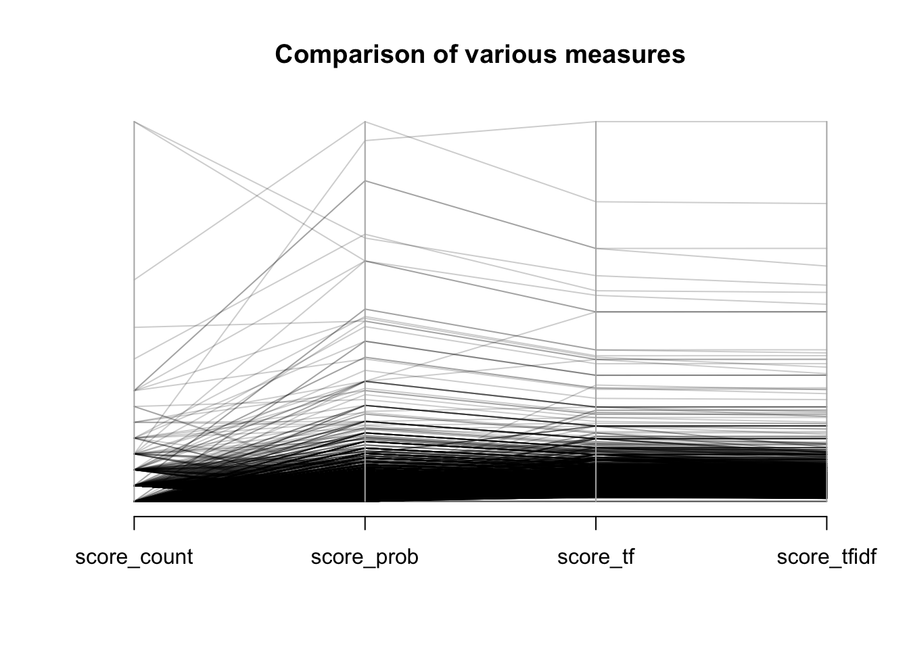

---
project: 'public-bible'
tags:
- computation
- 'text-analysis'
- Bible
- Chronicling America
title: |
    America's Public Bible 001: Detecting biblical quotations in an OCRed
    page
---

The dataset has one text file for each page in the [Chronicling
America](http://chroniclingamerica.loc.gov/), some 10.5 million of them
at last count. I also have the King James Version of the Bible in text
files, with one line per verse. The aim is to create document-term
matrices for both the Bible and a subset of the Chronicling America
dataset. These document-term matrices will use the same vocabulary,
implying that they will have the same term dimension (the columns). We
can therefore multiple one matrix by the transpose of the other matrix,
creating a document-document matrix, where the values are a score that
measures the likelihood that the page in Chronicling America contains
the corresponding biblical verse. The purpose of this notebook is to
figure out how best to create and multiply those matrices, and to test
several ways of normalizing those matrices.

``` {.r}
library(MASS)
library(Matrix)
library(broom)
library(dplyr)
library(ggplot2)
library(purrr)
library(readr)
library(stringr)
library(text2vec)
library(tokenizers)
```

Create a character vector of each verse in the KJV, including the
Apocrypha. The names of the character vector will be the verse
references.

``` {.r}
chapter_files <- list.files("data/kjv", pattern = "\\.txt$",
                            recursive = TRUE, full.names = TRUE) 

chapter_names <- chapter_files %>% 
  str_replace("\\.txt", "") %>% 
  str_replace("data/kjv/.+\\/", "") %>% 
  str_replace("(\\d+)$", " \\1:") %>% 
  str_replace("Psalms", "Psalm")

chapter_texts <- chapter_files %>% 
  map(read_lines) %>% 
  at_depth(1, str_replace, "\\d+\\s", "") 

names(chapter_texts) <- chapter_names 
bible_verses <- chapter_texts %>% unlist() 

# Sample verses
bible_verses[c("Romans 1:16", "John 3:16", "1 Esdras 1:1", "Psalm 95:1")] %>%
  unname()
```

    ## [1] "For I am not ashamed of the gospel of Christ: for it is the power of God unto salvation to every one that believeth; to the Jew first, and also to the Greek."
    ## [2] "For God so loved the world, that he gave his only begotten Son, that whosoever believeth in him should not perish, but have everlasting life."                
    ## [3] "And Josias held the feast of the passover in Jerusalem unto his Lord, and offered the passover the fourteenth day of the first month;"                        
    ## [4] "O come, let us sing unto the LORD: let us make a joyful noise to the rock of our salvation."

Now we are going to build a vocabulary from those biblical texts. In
this case we will just use 5-grams. In practice we will likely use a mix
of various n-grams.

``` {.r}
fivegrammer <- function(x) tokenize_ngrams(x, n = 5)
verses_it <- itoken(bible_verses, tokenizer = fivegrammer)
biblical_vocab <- create_vocabulary(verses_it)
```

With that vocabulary, we are going to build two document-term matrices
with the number of occurences of each n-gram in each document. The first
is of the uses of each n-gram in the Bible.

``` {.r}
verses_it <- itoken(bible_verses, tokenizer = fivegrammer)
bible_dtm <- create_dtm(verses_it, vocab_vectorizer(biblical_vocab))
```

Now we will do the same for a sample set of publications in Chronicling
America. Notice that we are going to use the biblical vocabulary, not a
vocabulary defined by the contents of the newspaper pages, so we are
looking only for biblical language.

``` {.r}
newspaper_pages <- list.files("data/sample-data", pattern = "\\.txt$", 
                              full.names = TRUE, recursive = TRUE)

# Munge the paths of the OCR pages to part of a URL to  Chronicling America
newspaper_id <- newspaper_pages %>% 
  str_replace("data/sample-data/", "") %>% 
  str_replace("ocr.txt", "") %>% 
  str_replace("(\\d{4})/(\\d{2})/(\\d{2})", "\\1-\\2-\\3")
```

There are 6,399 pages in the test data. We will time how long it takes
to make the DTM.

``` {.r}
system.time({
  files_it <- ifiles(newspaper_pages, reader_function = read_file)
  pages_it <- itoken(files_it, tokenizer = fivegrammer)
  newspaper_dtm <- create_dtm(pages_it, vocab_vectorizer(biblical_vocab))
  rownames(newspaper_dtm) <- newspaper_id
})
```

    ##    user  system elapsed 
    ##  88.606  17.524 109.230

Both of these are very sparse matrices.

``` {.r}
sparsity <- function(m) {
  nnzero(m) / length(m)
}
sparsity(bible_dtm) 
```

    ## [1] 3.069413e-05

``` {.r}
sparsity(newspaper_dtm) 
```

    ## [1] 7.632073e-07

What we want to know is which Bible verses appear on which newspaper
pages. We can do that by multiplying the Bible verses matrix by the
transpose of the newspaper matrix. Notice that our two document-term
matrices share a common dimension, thanks to the fact that we are using
the same 4-grams as the columns of both.

``` {.r}
dim(bible_dtm)
```

    ## [1]  36943 693113

``` {.r}
dim(newspaper_dtm)
```

    ## [1]   6399 693113

If we multiply the two matrices without normalizing them, the meaning of
the score is a count of the number of tokens that appear in both
documents.

``` {.r}
similarity_count <- tcrossprod(bible_dtm, newspaper_dtm)
```

A few helper functions to help us navigate the data.

``` {.r}
stopwords <- c("a", "an", "and", "are", "as", "at", "be", "but", "by", "for",
               "if", "in", "into", "is", "it", "no", "not", "of", "on", "or",
               "such", "that", "the", "their", "then", "there", "these", 
               "they", "this", "to", "was", "will", "with", "i", "said", 
               "should", "from", "he", "have", "us", "our", "his", "shall",
               "him", "so", "yet")
words_on_page <- function(id) {
  used <- newspaper_dtm[id, , drop = TRUE]
  used <- used[used > 0] %>% sort(decreasing = TRUE)
  used <- names(used)
  used <- str_c(used, collapse = " ")
  used <- tokenize_words(used, simplify = TRUE) %>% unique()
  used <- used[!used %in% stopwords]
  str_c(used, collapse = " ")
}
words_on_page <- Vectorize(words_on_page, SIMPLIFY = TRUE, USE.NAMES = FALSE)

words_on_page(c("sn87065520/1846-03-07/ed-1/seq-3/", "sn87065520/1846-03-07/ed-1/seq-3/")) 
```

    ## [1] "fowl air heathen thine inheritance thee give me over every unto them fruitful god blessed female created male image man creeping thing earth sea fish dominion let likeness make face uttermost parts creepeth streets city law ask replenish head"
    ## [2] "fowl air heathen thine inheritance thee give me over every unto them fruitful god blessed female created male image man creeping thing earth sea fish dominion let likeness make face uttermost parts creepeth streets city law ask replenish head"

``` {.r}
extract_date <- function(x) {
  str_extract(x, "\\d{4}-\\d{2}-\\d{2}")[[1]] %>% as.Date()
}

extract_date("sn87065520/1846-03-07/ed-1/seq-3/")
```

    ## [1] "1846-03-07"

``` {.r}
ca_url <- function(lccn, words) {
  words <- tokenize_words(words)[[1]] %>% str_c(collapse = "+")
  str_c("http://chroniclingamerica.loc.gov/lccn/", lccn, "#words=", words)
}
ca_url <- Vectorize(ca_url, USE.NAMES = FALSE)

ca_url("sn87065520/1846-03-07/ed-1/seq-3/", c("sample words"))
```

    ## [1] "http://chroniclingamerica.loc.gov/lccn/sn87065520/1846-03-07/ed-1/seq-3/#words=sample+words"

Now we can turn our document to document matrix into a data frame,
extract the date and URL from the page information, and browse the
Chronicling America website with key terms highlighted.

``` {.r}
test_matches <- similarity_count %>% 
  tidy() %>% 
  tbl_df() %>% 
  rename(verse = row, page = column, score = value) %>% 
  arrange(desc(score)) %>% 
  head(20) %>% 
  mutate(date = extract_date(page), 
         url = ca_url(page, words_on_page(page))) 
test_matches
```

    ## Source: local data frame [20 x 5]
    ## 
    ##                         verse                              page score
    ##                        (fctr)                            (fctr) (dbl)
    ## 1                Genesis 1:26 sn87065520/1846-03-07/ed-1/seq-3/    25
    ## 2                Genesis 1:28 sn87065520/1846-03-07/ed-1/seq-3/    25
    ## 3                   Psalm 2:8 sn87065520/1846-03-07/ed-1/seq-3/    15
    ## 4            Lamentations 1:1 sn84026005/1871-10-28/ed-1/seq-2/    12
    ## 5                Genesis 1:27 sn87065520/1846-03-07/ed-1/seq-3/    10
    ## 6              1 Samuel 25:42 2010218500/1902-08-05/ed-1/seq-7/     8
    ## 7              Proverbs 22:29 2010218500/1902-11-11/ed-1/seq-4/     8
    ## 8              Ephesians 5:31 sn85026279/1858-11-19/ed-1/seq-1/     8
    ## 9                   Mark 10:7 sn85026279/1858-11-19/ed-1/seq-1/     8
    ## 10                  Job 13:25 sn94052752/1902-06-19/ed-1/seq-3/     8
    ## 11               Genesis 3:19 sn85026279/1856-07-11/ed-1/seq-4/     7
    ## 12 Acts of the Apostles 20:35 sn85026279/1856-10-31/ed-1/seq-1/     7
    ## 13               Genesis 3:19 sn85026279/1856-11-21/ed-1/seq-4/     7
    ## 14              Genesis 28:22 sn84026005/1870-10-20/ed-1/seq-2/     6
    ## 15              1 Samuel 22:2 sn84026005/1872-03-23/ed-1/seq-2/     6
    ## 16               Genesis 3:19 sn85026279/1856-07-04/ed-1/seq-4/     6
    ## 17                  Psalm 8:8 sn87065520/1846-03-07/ed-1/seq-3/     6
    ## 18                2 Kings 4:7 sn84026005/1869-02-13/ed-1/seq-1/     5
    ## 19                   John 1:1 sn84026005/1870-08-03/ed-1/seq-2/     5
    ## 20               Matthew 6:30 sn84026005/1872-09-19/ed-1/seq-2/     5
    ## Variables not shown: date (date), url (chr)

If we look at those pages on Chronicling America, this is what we find.
[This
page](http://chroniclingamerica.loc.gov/lccn/sn87065520/1846-03-07/ed-1/seq-3/#words=fowl+air+heathen+thine+inheritance+thee+give+me+over+every+unto+them+fruitful+god+blessed+female+created+male+image+man+creeping+thing+earth+sea+fish+dominion+let+likeness+make+face+uttermost+parts+creepeth+streets+city+law+ask+replenish+head),
for example, contains a report of a speech by John Quincy Adams in the
House of Representatives, which quotes Genesis 1:26--28 and Psalm 2:8 in
full, as well as various other partial quotations or allusions.[^1] But
there are also false positives, such as [this
page](http://chroniclingamerica.loc.gov/lccn/sn87065520/1846-03-07/ed-1/seq-3/)
is a false match.[^2] It has a number of biblical n-grams, but none of
them are particularly biblical: they could appear in many different
English sentences. This points out that the method needs some
refinement: we probably need more than just n-grams where $n$ is bigger
than 4 to detect more unusual langauge; we should not just be counting
up "biblical" language but should be looking for matches to particular
verses; and we may need to scale the occurence matrix so that we weight
phrases which tend to appear only in the Bible more that phrases which
can be a part of any English sentence.

There is also a quotation from Lamentations 1:1. If we look up the
newspaper page, we find [this
story](http://chroniclingamerica.loc.gov/lccn/sn84026005/1871-10-28/ed-1/seq-2/)
in the *Petroleum Centre Daily Record* (text taken from OCR file).[^3]

> One o! tbe most remarkable lootdenls or the Cbicagojflte was tbe
> saving of just one leaf of s quarto Bible out or tbe whole tlock of
> books magazines and newspspers belong ing to tbe Western Newt Comp oy.
> It con- tained tbe first chapter ot tbe Lamentations of Jeremiah,
> which opens with the following words: "How doth the city sit solitary
> that was full of people! bow is she ' become as a widow ! she that was
> great amoog the nstlons sod princes among tbe provinces, howls sbe
> become tributary! She weepetb tore in tbe night, andber ears are on
> her cheeks, smeng all ber lovers tbe bath none to comfort t er "

The reference to Ephesians 5:31 [is a
joke](http://chroniclingamerica.loc.gov/lccn/sn85026279/1858-11-19/ed-1/seq-1/)
at the expense of an "old Scotch Highland minister" which turns on
changing a word of that verse.

We need to think more carefully, though, about what the scores
represent. Because of the way matrix multiplication works, they
essentially represent the sum of the n-grams that appear in each
newspaper page that also appear in a given verse. This will of course
give higher scores to longer quotations from longer verses.

It would be more useful to know something like a probability that a
verse appears on a page. That would give our method more
interpretability (e.g., we would better know which matches to throw
away). Alternatively, we might get more reliable results by normalizing
the matrices according to a scheme like TF-IDF instead of weighting all
biblical n-grams equally. We will give extra weight to n-grams which
appear in only one verse or a few verses, and give little weight to
n-grams which appear in many verses (for example, "thus saith the Lord",
"and it came to pass").

We will test this by creating the document-to-document similarity
matrices for several different weighting schemes.

First, use the un-normalized similarity scores.

``` {.r}
similarity_count_df <- similarity_count %>% 
  tidy() %>% 
  tbl_df() %>%
  rename(verse = row, page = column, score_count = value) 
```

Weight the verses DTM by term frequency (which is the same as dividing
each element in a row by the sum of the row) and the newspaper DTM by
dividing each element in a column by its column sums.

``` {.r}
transform_colsums <- function(m) {
  m %*% Diagonal(x = 1 / colSums(m)) 
}

similarity_prob <- tcrossprod(transform_tf(bible_dtm), 
                              transform_colsums(newspaper_dtm))
similarity_prob_df <- similarity_prob %>% 
  tidy() %>% 
  tbl_df() %>% 
  rename(verse = row, page = column, score_prob = value) 
```

Weight the verses DTM by term frequency, and leave the newspaper DTM
unweighted.

``` {.r}
similarity_tf <- tcrossprod(transform_tf(bible_dtm), newspaper_dtm)
similarity_tf_df <- similarity_tf %>% 
  tidy() %>% 
  tbl_df() %>% 
  rename(verse = row, page = column, score_tf = value) 
```

Weight the verses DTM by TF-IDF, and leave the newspaper DTM unweighted.

``` {.r}
similarity_tfidf <- tcrossprod(transform_tfidf(bible_dtm), newspaper_dtm)
```

    ## idf scaling matrix not provided, calculating it form input matrix

``` {.r}
similarity_tfidf_df <- similarity_tfidf %>% 
  tidy() %>% 
  tbl_df() %>% 
  rename(verse = row, page = column, score_tfidf = value) 
```

Now we can join all of those data frames together and plot them in a
parallel coordinates plot.

``` {.r}
score_cf <- similarity_count_df %>% 
  left_join(similarity_prob_df, by = c("verse", "page")) %>% 
  left_join(similarity_tf_df, by = c("verse", "page")) %>% 
  left_join(similarity_tfidf_df, by = c("verse", "page")) 

score_cf %>% 
  dplyr::select(starts_with("score")) %>% 
  MASS::parcoord(col = rgb(0, 0, 0, alpha = 0.2),
           main = "Comparison of various measures")
```



It appears that different ways of normalizing the matrices affect the
rankings, sometimes in substantial ways. We will need to use a more
formal method to evaluate exactly which kind of normalization is best,
as well as what the cut-off point is between matches and non-matches. We
can turn this into a supervised classification problem by creating a
test set of known matches and non-matches. As a preliminary to doing so,
let's look at a few instances.

``` {.r}
score_cf_urls <- score_cf %>% 
  arrange(desc(score_prob)) %>% 
  top_n(20, score_prob) %>% 
  mutate(date = extract_date(page), 
         url = ca_url(page, words_on_page(page))) 
score_cf_urls
```

    ## Source: local data frame [21 x 8]
    ## 
    ##             verse                              page score_count score_prob
    ##            (fctr)                            (fctr)       (dbl)      (dbl)
    ## 1       Psalm 2:8 sn87065520/1846-03-07/ed-1/seq-3/          15  0.7894737
    ## 2     Exodus 20:8 sn84026005/1870-03-22/ed-1/seq-2/           4  0.7500000
    ## 3       Mark 10:7 sn85026279/1858-11-19/ed-1/seq-1/           8  0.6666667
    ## 4       Job 13:25 sn94052752/1902-06-19/ed-1/seq-3/           8  0.6666667
    ## 5    Genesis 1:27 sn87065520/1846-03-07/ed-1/seq-3/          10  0.5555556
    ## 6    Genesis 1:28 sn87065520/1846-03-07/ed-1/seq-3/          25  0.5476190
    ## 7  Proverbs 22:29 2010218500/1902-11-11/ed-1/seq-4/           8  0.5000000
    ## 8    Proverbs 5:5 sn84026005/1873-10-14/ed-1/seq-2/           4  0.5000000
    ## 9    Genesis 1:26 sn87065520/1846-03-07/ed-1/seq-3/          25  0.5000000
    ## 10   Romans 14:16 sn85026279/1857-01-02/ed-1/seq-2/           2  0.4000000
    ## ..            ...                               ...         ...        ...
    ## Variables not shown: score_tf (dbl), score_tfidf (dbl), date (date), url
    ##   (chr)

This is an [interesting
example](http://chroniclingamerica.loc.gov/lccn/2010218500/1902-11-11/ed-1/seq-4/#words=stand+before+kings+diligent+business+man+thou+army+lusts+flesh)[^4]:

``` {.r}
score_cf_urls %>% slice(8)
```

    ## Source: local data frame [1 x 8]
    ## 
    ##          verse                              page score_count score_prob
    ##         (fctr)                            (fctr)       (dbl)      (dbl)
    ## 1 Proverbs 5:5 sn84026005/1873-10-14/ed-1/seq-2/           4        0.5
    ## Variables not shown: score_tf (dbl), score_tfidf (dbl), date (date), url
    ##   (chr)

We have found the one reference to Proverbs 5:5 (text from OCR):

> Ret McCann, a young woman residing at Babylon, one of taal class of
> wnom it is said in Proverbs: "Hor feet go down to death; her steps
> take bold oa bull," died yesterday afternoon uuder circumstances which
> lead lo tbo supposition tbat she Com mitted eulcltls by the uso ol
> chloiofoim.

But we did not find the reference at the end of the passage, for which
only the 3-gram "bitter as wormwood" survives unmangled by the OCR:

> Her e.-td is bitter as wormwood, sbaip as a Iwo-rdMi rwurd. "

We will also have to consider the best way of tokenizing the text.

[^1]: The Panola Miss. lynx. (Panola, Mi. \[i.e. Miss.\]), 07 March
    1846. Chronicling America: Historic American Newspapers. Lib. of
    Congress.
    <http://chroniclingamerica.loc.gov/lccn/sn87065520/1846-03-07/ed-1/seq-3/>

[^2]: The Inter-mountain farmer and ranchman. (Salt Lake City, Utah), 18
    Feb. 1902. Chronicling America: Historic American Newspapers. Lib.
    of Congress.
    <http://chroniclingamerica.loc.gov/lccn/2010218500/1902-02-18/ed-1/seq-5/>

[^3]: The Petroleum Centre daily record. (Petroleum Center, Pa.), 28
    Oct. 1871. Chronicling America: Historic American Newspapers. Lib.
    of Congress.
    <http://chroniclingamerica.loc.gov/lccn/sn84026005/1871-10-28/ed-1/seq-2/>

[^4]: The Inter-mountain farmer and ranchman. (Salt Lake City, Utah), 11
    Nov. 1902. Chronicling America: Historic American Newspapers. Lib.
    of Congress.
    <http://chroniclingamerica.loc.gov/lccn/2010218500/1902-11-11/ed-1/seq-4/>
