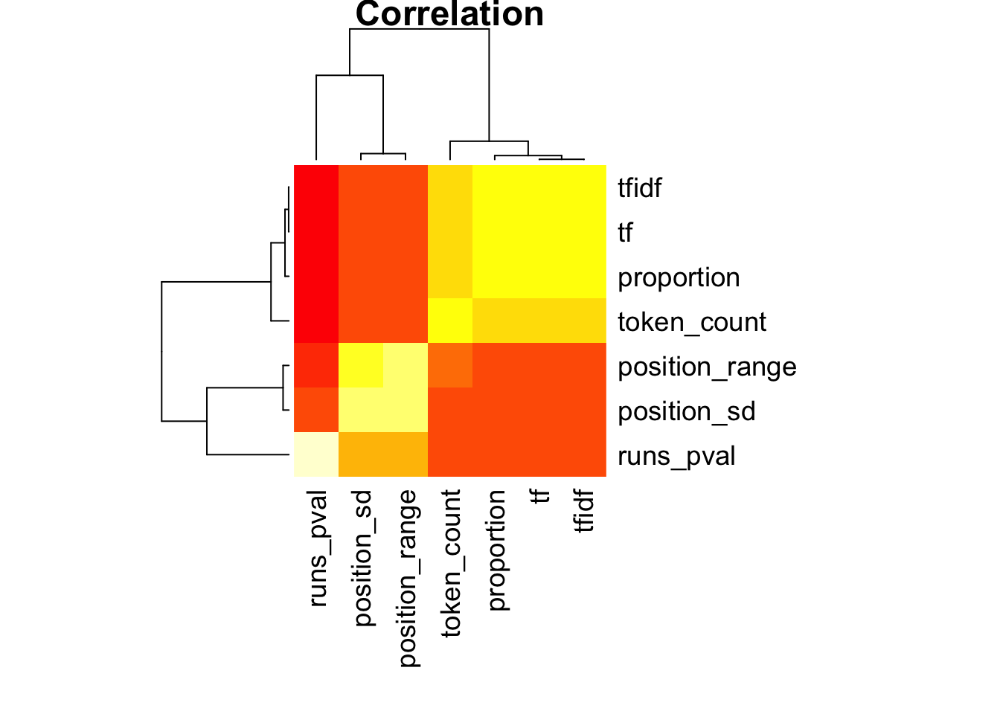
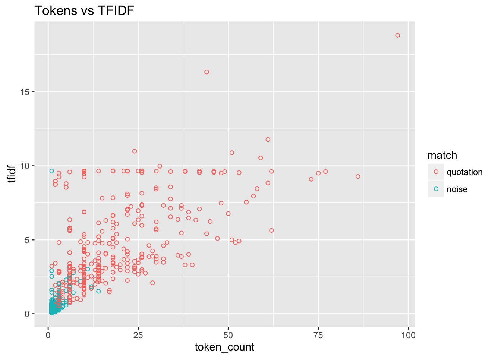
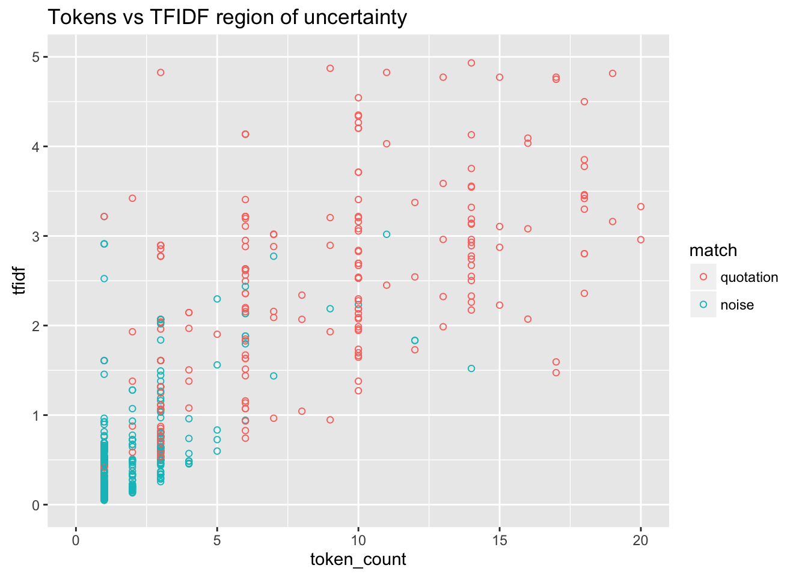
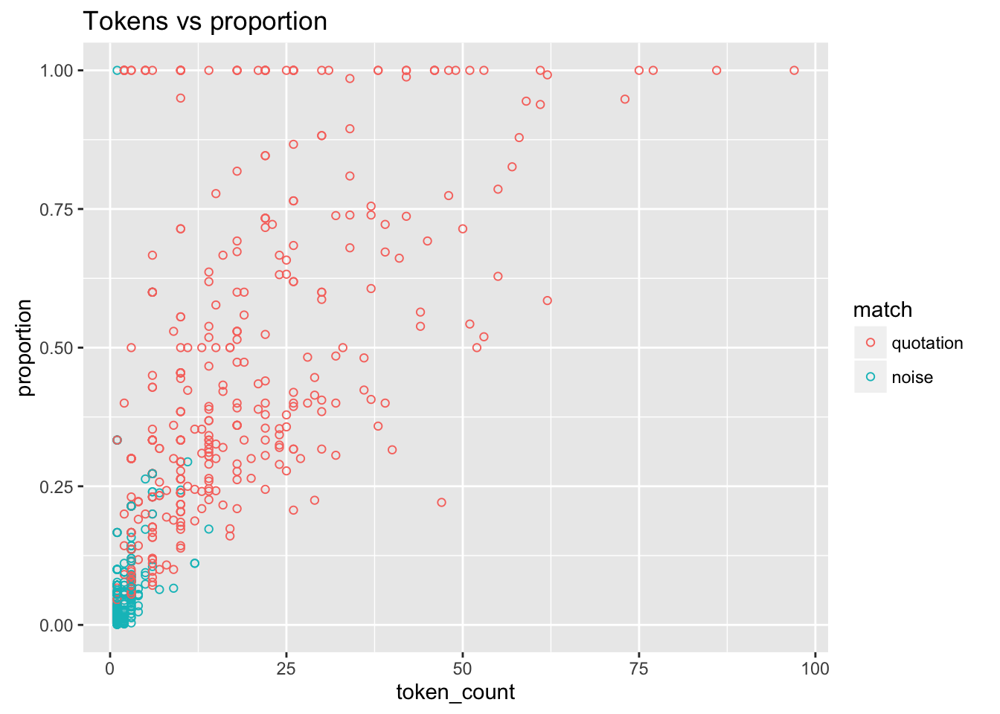
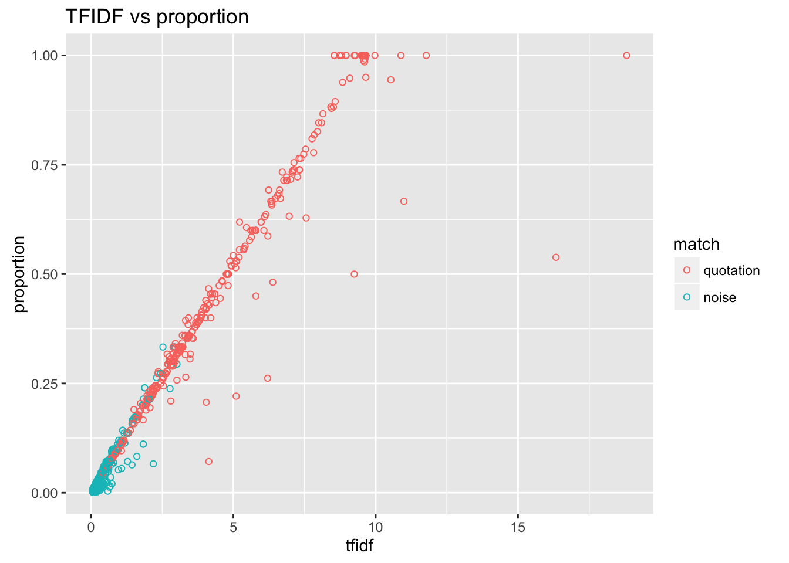
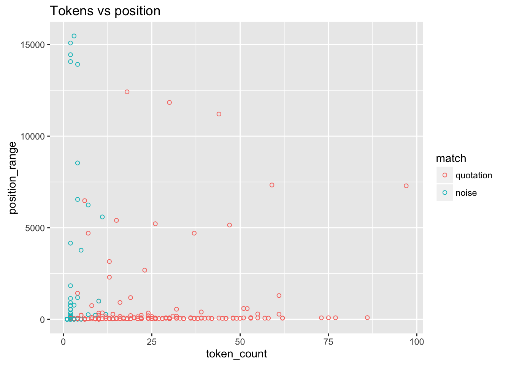
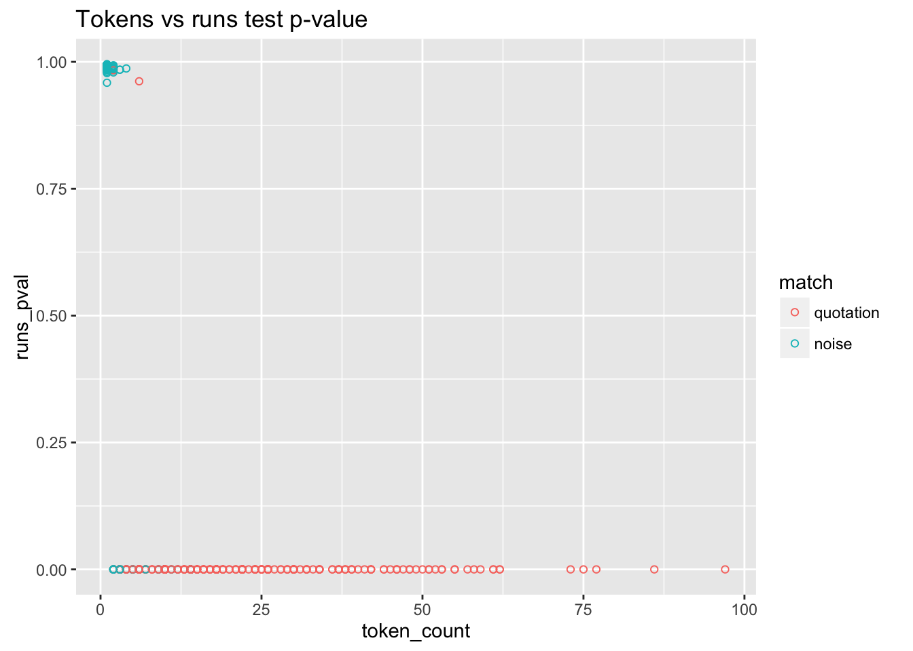
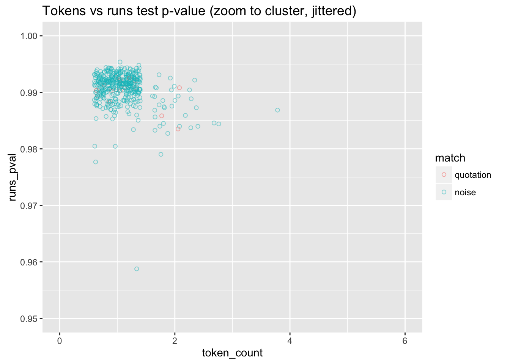
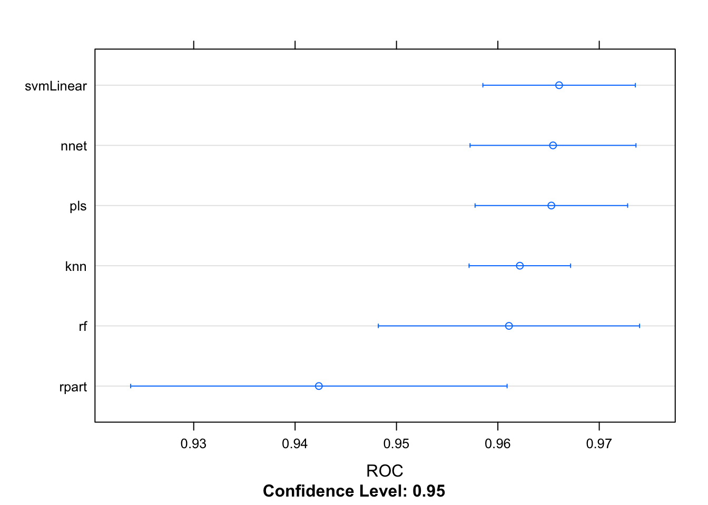
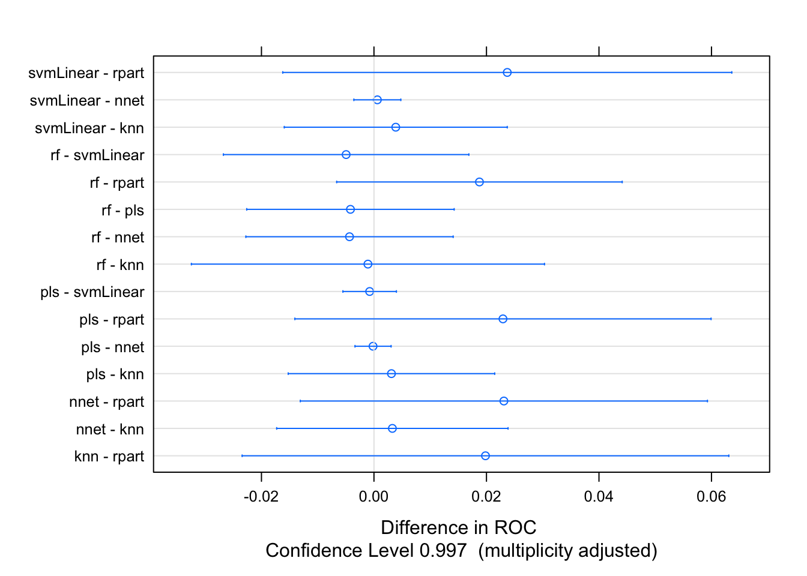

---
project: 'public-bible'
tags:
- computation
- 'text-analysis'
- Bible
- Chronicling America
title: Create predictive model from labeled data
---

I have created a set of labeled data that marks pairs of verses and
newspaper pages as matches. The data requires some cleanup to make the
`TRUE`/`FALSE` values into a factor. We also have two variables,
`position_range` and `position_sd`, which are undefined for matches with
only one token. To those we will assign a value of `0`. And then we will
create a separate data frame, `predictors`, removing the page and verse
reference.

``` {.r}
library(feather)
library(dplyr)
library(ggplot2)
library(tidyr)
library(caret)
library(randomForest)
library(pls)
library(pROC)
library(kernlab)
library(doParallel)
library(nnet)
library(caretEnsemble)

replace_na <- function(x, replace) {
  ifelse(is.na(x), replace, x)
}

relabel_matches <- function(x) {
  stopifnot(is.logical(x))
  x <- ifelse(x, "quotation", "noise")
  x <- factor(x, levels = c("quotation", "noise"))
  x
}

labeled <- read_feather("data/labeled-features.feather") %>% 
  select(reference, page, match, everything()) %>% 
  mutate(match = relabel_matches(match),
         position_sd = replace_na(position_sd, 0),
         position_range = replace_na(position_range, 0))

predictors <- labeled %>% select(-page, -reference)
predictors_m <- predictors %>% select(-match) %>% as.matrix()
```

Now we want to test the correlations between the different predictors.
The predictors fall into certain groups. The `token_count`, `tf` and
`tfidf` count how many matching n-grams there are, the latter two being
weighted. The `proportion` measures what percentage of the total tokens
in the verse are present on the newspaper page. `position_sd` and
`position_range` measure how far apart matching tokens are from one
another on the page. The assumption is that tokens that are closer
together are more likely to indicate a match. (Though sometimes in
sermons fragments of the verse get quoted over and over.) I have my
doubts about the usefulness of those two predictors. And `runs_pval` is
a statistical test for randomness in the run of matches: a lower score
means it is more likely to be a non-random match.

If any of the predictors are highly correlated, that is a strong
indication that they are measuring the same information and are unlikely
to provide more information when used together.

``` {.r}
cor(predictors_m) %>% knitr::kable()
```

                      token\_count        tfidf           tf   proportion   position\_range   position\_sd   runs\_pval
  ----------------- -------------- ------------ ------------ ------------ ----------------- -------------- ------------
  token\_count           1.0000000    0.7717289    0.7665391    0.7438801         0.1233693      0.0504615   -0.5398870
  tfidf                  0.7717289    1.0000000    0.9991397    0.9769236         0.1073784      0.0357356   -0.6028469
  tf                     0.7665391    0.9991397    1.0000000    0.9780309         0.1079063      0.0363336   -0.6054290
  proportion             0.7438801    0.9769236    0.9780309    1.0000000         0.0286719     -0.0137057   -0.6155220
  position\_range        0.1233693    0.1073784    0.1079063    0.0286719         1.0000000      0.9476033   -0.0511884
  position\_sd           0.0504615    0.0357356    0.0363336   -0.0137057         0.9476033      1.0000000   -0.0056157
  runs\_pval            -0.5398870   -0.6028469   -0.6054290   -0.6155220        -0.0511884     -0.0056157    1.0000000

``` {.r}
cor(predictors_m) %>% heatmap(main = "Correlation", margins = c(10, 10))
```



Some observations:

-   The count of tokens and the TFIDF weighting have a fairly low
    correlation, so they can be used together.
-   The TFIDF and TF have a very high correlation. We can drop TF.
-   Proportion and TFIDF are highly correlated, but it may be worthwhile
    to keep proportion since it is highly interpretable.
-   The range and sd positions are highly correlated: probably should
    keep only one of those.
-   The runs test is not hingly correlated with anything, so it is
    providing different information.

Let's look at some scatterplots of the predictors to see whether they
are useful.

``` {.r}
base <- ggplot(predictors, aes(color = match)) 

base + geom_point(aes(token_count, tfidf), shape = 1) + ggtitle("Tokens vs TFIDF")
```



``` {.r}
base + geom_point(aes(token_count, tfidf), shape = 1) + ggtitle("Tokens vs TFIDF region of uncertainty") + xlim(0, 20) + ylim(0,5)
```

    ## Warning: Removed 177 rows containing missing values (geom_point).



``` {.r}
base + geom_point(aes(token_count, proportion), shape = 1) + ggtitle("Tokens vs proportion")
```



``` {.r}
base + geom_point(aes(tfidf, proportion), shape = 1) + ggtitle("TFIDF vs proportion")
```



``` {.r}
base + geom_point(aes(token_count, position_range), shape = 1) + ggtitle("Tokens vs position")
```



``` {.r}
base + geom_point(aes(token_count, runs_pval), shape = 1) + ggtitle("Tokens vs runs test p-value")
```



``` {.r}
base + geom_jitter(aes(token_count, runs_pval), shape = 1, alpha = 0.5) + ggtitle("Tokens vs runs test p-value (zoom to cluster, jittered)") + xlim(0, 6) + ylim(0.95, 1.0)
```

    ## Warning: Removed 481 rows containing missing values (geom_point).



We can therefore try to create two sets of predictors: our best guess at
the useful predictors, and a collections of all the predictors. Update:
in practice we are never going to use the position range or position SD.

``` {.r}
predict_selected <- match ~ token_count + tfidf + proportion + runs_pval
```

Now we will create a training/test split of our `nrow(labeled)`
observations.

``` {.r}
set.seed(7347)
split_i <- createDataPartition(y = predictors$match, p = 0.7, list = FALSE)
training <- predictors[split_i, ]
rownames(training) <- NULL
testing  <- predictors[-split_i, ]
testing_references <- labeled[-split_i, ]
```

And we intend to use repeated cross-validation, so prepare our training
control.

``` {.r}
tr_ctrl <- trainControl(method = "repeatedcv", 
                        number = 10, 
                        repeats = 5, 
                        savePredictions = "final",
                        classProbs = TRUE,
                        index = createResample(training$match, 5),
                        summaryFunction = twoClassSummary)
```

Now we are going to train a list of models

``` {.r}
set.seed(7347)
registerDoParallel(8, cores = 8)
getDoParWorkers()
```

    ## [1] 8

``` {.r}
model_list <- caretList(
  predict_selected,
  data = training, 
  metric = "ROC",
  preProc = c("center", "scale"),
  trControl = tr_ctrl,
  tuneLength = 30,
  methodList = c("rf", "pls", "svmLinear", "nnet", "knn", "rpart")
  )
```

    ## note: only 3 unique complexity parameters in default grid. Truncating the grid to 3 .
    ## 
    ## # weights:  91
    ## initial  value 441.718346 
    ## iter  10 value 143.219147
    ## iter  20 value 140.182715
    ## iter  30 value 138.577301
    ## iter  40 value 138.311983
    ## iter  50 value 138.259382
    ## iter  60 value 138.240494
    ## iter  70 value 138.225178
    ## iter  80 value 138.222350
    ## iter  90 value 138.220999
    ## iter 100 value 138.219899
    ## final  value 138.219899 
    ## stopped after 100 iterations

    ## Loading required package: rpart

Having trained several models, we want to evaluate their performance.

``` {.r}
resamp <- resamples(model_list)
modelCor(resamp) 
```

    ##                    rf       pls  svmLinear      nnet          knn
    ## rf         1.00000000 0.8026587 0.66434222 0.7875460 -0.023637758
    ## pls        0.80265866 1.0000000 0.96059917 0.9870482  0.202724204
    ## svmLinear  0.66434222 0.9605992 1.00000000 0.9756735  0.055809306
    ## nnet       0.78754596 0.9870482 0.97567348 1.0000000  0.105665889
    ## knn       -0.02363776 0.2027242 0.05580931 0.1056659  1.000000000
    ## rpart      0.80214541 0.4708431 0.31252228 0.5053256  0.005061788
    ##                 rpart
    ## rf        0.802145407
    ## pls       0.470843091
    ## svmLinear 0.312522284
    ## nnet      0.505325609
    ## knn       0.005061788
    ## rpart     1.000000000

``` {.r}
dotplot(resamp, metric = "ROC")
```



``` {.r}
rocDiffs <- diff(resamp, metric = "ROC")
summary(rocDiffs) 
```

    ## 
    ## Call:
    ## summary.diff.resamples(object = rocDiffs)
    ## 
    ## p-value adjustment: bonferroni 
    ## Upper diagonal: estimates of the difference
    ## Lower diagonal: p-value for H0: difference = 0
    ## 
    ## ROC 
    ##           rf     pls        svmLinear  nnet       knn        rpart     
    ## rf               -0.0041814 -0.0049472 -0.0043450 -0.0010731  0.0187504
    ## pls       1.0000            -0.0007658 -0.0001635  0.0031084  0.0229319
    ## svmLinear 1.0000 1.0000                 0.0006022  0.0038741  0.0236976
    ## nnet      1.0000 1.0000     1.0000                 0.0032719  0.0230954
    ## knn       1.0000 1.0000     1.0000     1.0000                 0.0198235
    ## rpart     0.1481 0.2684     0.3090     0.2437     0.6849

``` {.r}
dotplot(rocDiffs)
```



``` {.r}
models_selected <- model_list
models_selected$svmLinear <- NULL
models_selected$nnet <- NULL
models_selected$rpart <- NULL
ensemble <- caretEnsemble(
  models_selected,
  metric = "ROC",
  trControl = trainControl(
    number = 20,
    summaryFunction = twoClassSummary,
    classProbs = TRUE
    ))
summary(ensemble)
```

    ## The following models were ensembled: rf, pls, knn 
    ## They were weighted: 
    ## -4.5419 1.7025 4.1423 3.4499
    ## The resulting ROC is: 0.9652
    ## The fit for each individual model on the ROC is: 
    ##  method       ROC       ROCSD
    ##      rf 0.9610935 0.010377222
    ##     pls 0.9652750 0.006058667
    ##     knn 0.9621666 0.004032246

``` {.r}
model_preds <- lapply(model_list, predict, newdata = testing)
model_preds_prob <- lapply(model_list, predict, newdata=testing, type = "prob")
ens_preds <- predict(ensemble, newdata = testing)
ens_preds_prob <- predict(ensemble, newdata = testing, type = "prob")
model_preds$ensemble <- ens_preds

conf <- lapply(model_preds, confusionMatrix, testing$match)

get_accuracy_measures <- function(model_name, cm) {
  x <- cm$byClass
  data_frame(model = model_name, measure = names(x), value = unname(x))
}

lapply(names(conf), function(n) { get_accuracy_measures(n, conf[[n]])}) %>% 
  bind_rows() %>%
  spread(measure, value) %>% 
  knitr::kable()
```

  model         Balanced Accuracy   Detection Prevalence   Detection Rate   Neg Pred Value   Pos Pred Value   Prevalence   Sensitivity   Specificity
  ----------- ------------------- ---------------------- ---------------- ---------------- ---------------- ------------ ------------- -------------
  ensemble              0.9286012              0.4056940        0.3772242        0.9341317        0.9298246    0.4163701     0.9059829     0.9512195
  knn                   0.9273765              0.3985765        0.3736655        0.9289941        0.9375000    0.4163701     0.8974359     0.9573171
  nnet                  0.9231030              0.3950178        0.3701068        0.9235294        0.9369369    0.4163701     0.8888889     0.9573171
  pls                   0.8938660              0.4804270        0.3914591        0.9520548        0.8148148    0.4163701     0.9401709     0.8475610
  rf                    0.9334740              0.3914591        0.3736655        0.9298246        0.9545455    0.4163701     0.8974359     0.9695122
  rpart                 0.9060350              0.4234875        0.3736655        0.9259259        0.8823529    0.4163701     0.8974359     0.9146341
  svmLinear             0.9115072              0.3914591        0.3629893        0.9122807        0.9272727    0.4163701     0.8717949     0.9512195

``` {.r}
# Find out which predictions were wrong
# bind_cols(testing_references, data_frame(prediction = ens_preds)) %>% 
#   filter(match != prediction) %>% 
#   View
```

We will test the ensemble model on the unlabeled data.

``` {.r}
sample_predictors <- read_feather("data/all-features.feather")
nrow(sample_predictors)
```

    ## [1] 461729

``` {.r}
system.time({
all_predictions_ensemble <- sample_predictors %>% 
  mutate(prediction = predict(ensemble, newdata = sample_predictors))
})
```

    ##    user  system elapsed 
    ##  26.826   0.591  27.427

``` {.r}
system.time({
all_predictions_nnet <- sample_predictors %>% 
  mutate(prediction = predict(model_list$nnet, newdata = sample_predictors))
})
```

    ##    user  system elapsed 
    ##   0.921   0.154   1.076

``` {.r}
table(all_predictions_ensemble$prediction)
```

    ## 
    ## quotation     noise 
    ##      2882    458847

``` {.r}
table(all_predictions_nnet$prediction)
```

    ## 
    ## quotation     noise 
    ##      2297    459432

Let's write the model and the Bible data payload to disk for use in our
script.

``` {.r}
load("data/bible.rda")
save(ensemble, bible_verses, bible_dtm, bible_vocab, bible_tokenizer, 
     file = "data/prediction-payload.rda", compress = FALSE)
```
