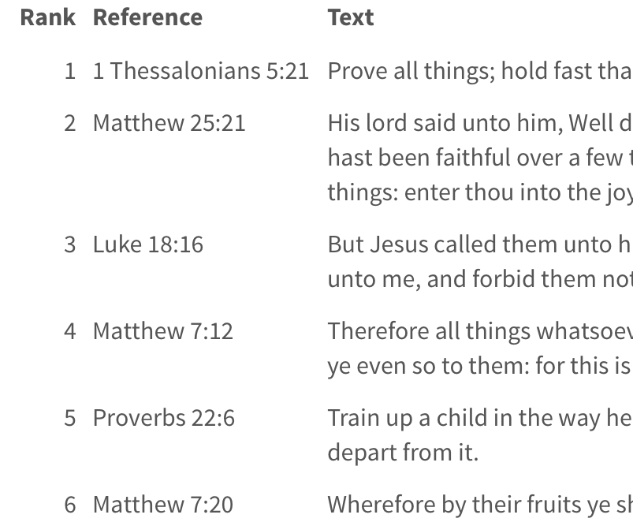

```{r setup, include=FALSE}
knitr::opts_chunk$set(echo = FALSE, message = FALSE, warning = FALSE,
                      comment = NA)
```

This page contains a series of mini-essays and visualizations about aspects of how the Bible was used in U.S. newspapers.

<div class="row">
<div class="col-sm-4">
<a href="most-quoted-by-decade.html">
<div class="thumbnail">

</div>
</a>
<div class="thumbnail-caption">
<a href="most-quoted-by-decade.html">
<h4>Most quoted verses by decade</h4>
</a>
</div>
</div>
</div>

